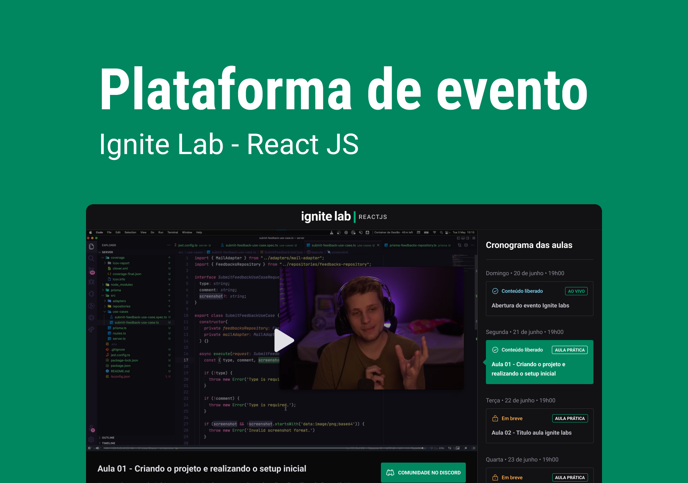

<h1 align="center">
     
</h1>

---

<h1 align="center">
     
</h1>

## 🏷️ Sobre 
**Event Plataform**: Plataforma de vídeos online

## Foco do estudo
- [x] React.js
- [x] GraphQL
- [x] Apollo GraphQL
- [x] GraphCMS
- [x] TailwindCSS

---

## 🛠️ Tecnologias e serviços utilizados
Foram utilizadas as seguintes tecnologias para desenvolver a aplicação **Event Plataform** :

- [HTML5](https://html.com/)
- [TailwindCSS](https://tailwindcss.com/)
- [React.js](https://pt-br.reactjs.org/)
- [Typescript](https://www.typescriptlang.org/)
- [GraphQL](https://graphql.org/)
- [Apollo GraphQL](https://www.apollographql.com/)
- [GraphCMS](https://app.hygraph.com/)

---

## 🗂️ Como baixar e iniciar o projeto 

```bash

    #clonar o projeto
    $ git clone https://github.com/ElisioWander/ignite-lab-2.git

    #entrar no diretório
    $ cd event-plataform

    #instalar as dependências
    $ npm install

    #iniciar a aplicação
    $ npm run dev
```
### Servidor local
localhost:3000

---

## Autor
### 👤 Elisio Wander

- Linkedin: [@elisioWander](https://www.linkedin.com/in/elisio-wander-b88b69136/)
- Github: [@elisioWander](https://github.com/ElisioWander)
- Site: [elisiowander.vercel.app](https://elisiowander.vercel.app)

---

## 📝 Licença
Copyright © 2020 [@ElisioWander](https://github.com/ElisioWander/ignite-lab-2/blob/main/LICENSE)

Este projeto está sobe a [LICENÇA MIT](https://opensource.org/licenses/MIT)

---

### Desenvolvido 💜 by Elisio Wander